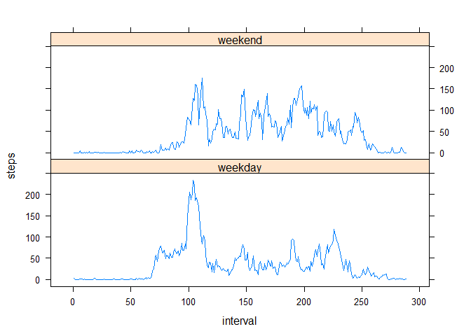

# Reproducible Research: Peer Assessment 1


## Loading and preprocessing the data

I loaded the data and I processed the data into a format suitable for analysis


```r
act <- read.csv("activity.csv",header = T)
act$dt <- strptime(act$date, "%Y-%m-%d") ##creating a new attribute: dt which is the date in POSIXt
act$interval <- as.factor(act$interval) ##setting the interval as factor
act$dtf <- as.factor(act$date) ##creating a new attribute (date as factor)
```


## What is mean total number of steps taken per day?


```r
t <- tapply(act$steps,act$dtf,sum,na.rm=T)
hist(t,nclass=10,xlab="Total number of steps taken per day",main="Total number of steps taken per day",col="red")
```

 

```r
mean(t)
```

```
## [1] 9354.23
```

```r
median(t)
```

```
## [1] 10395
```


## What is the average daily activity pattern?


```r
t2 <- tapply(act$steps,act$interval,mean,na.rm=T)
t2 <- data.frame(t2)
t2$interval <- row.names(t2)
names(t2) <- c("steps","interval")
with(t2,plot(interval,steps, col="blue",type="l"))
```

 

```r
mx <- which.max(t2$steps)
t2[mx,2]
```

```
## [1] "835"
```

## Imputing missing values

I replaced the missing values with the mean value of the steps

```r
sum(is.na(act$steps))  
```

```
## [1] 2304
```

```r
act2<-act
act2$steps <- replace(act2$steps,is.na(act2$steps),round(mean(act2$steps,na.rm=T),0)) ##replacing the missing values with the mean value
t3 <- tapply(act2$steps,act2$dtf,sum,na.rm=T)
hist(t3,nclass=10,xlab="Total number of steps taken per day",main="Total number of steps taken per day",col="red")
```

 

```r
mean(t3)
```

```
## [1] 10751.74
```

```r
median(t3)
```

```
## [1] 10656
```
These mean and median values differ from the estimates from the first part of the assignment. Imputing missing data has increasd the estimates of the total daily number of steps.


## Are there differences in activity patterns between weekdays and weekends?


```r
act4 <- act
act4$wd <- weekdays(act4$dt) 
act4$wend <- "weekday" ##creating a new attribute to flag the weekend days
act4$wend[act4$wd=="szombat"] <- "weekend"
act4$wend[act4$wd=="vasárnap"] <- "weekend"
library(reshape2)
```

```
## Warning: package 'reshape2' was built under R version 3.0.3
```

```r
act4melt <- melt(act4, id=c("wend","interval"),measure.vars = c("steps")) ##melting data
act4cast <- dcast(act4melt, wend + interval ~ variable,mean,na.rm=T) ##casting data
act4cast$interval <- as.numeric(act4cast$interval) ##using interval as numeric
library(lattice) 
```

```
## Warning: package 'lattice' was built under R version 3.0.3
```

```r
xyplot(steps ~ interval | wend, data=act4cast, layout=c(1,2),type="l")
```

 
